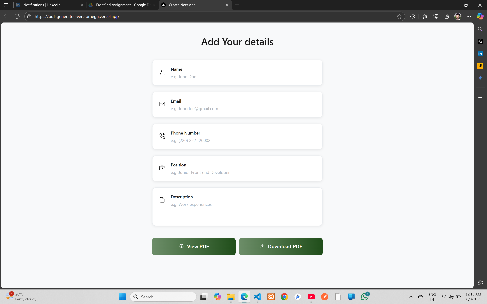
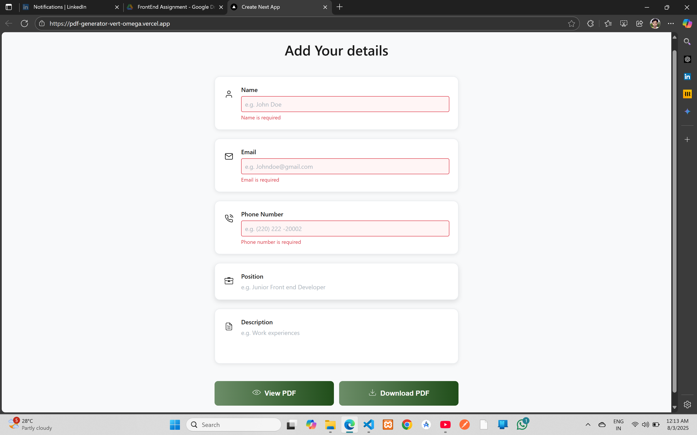
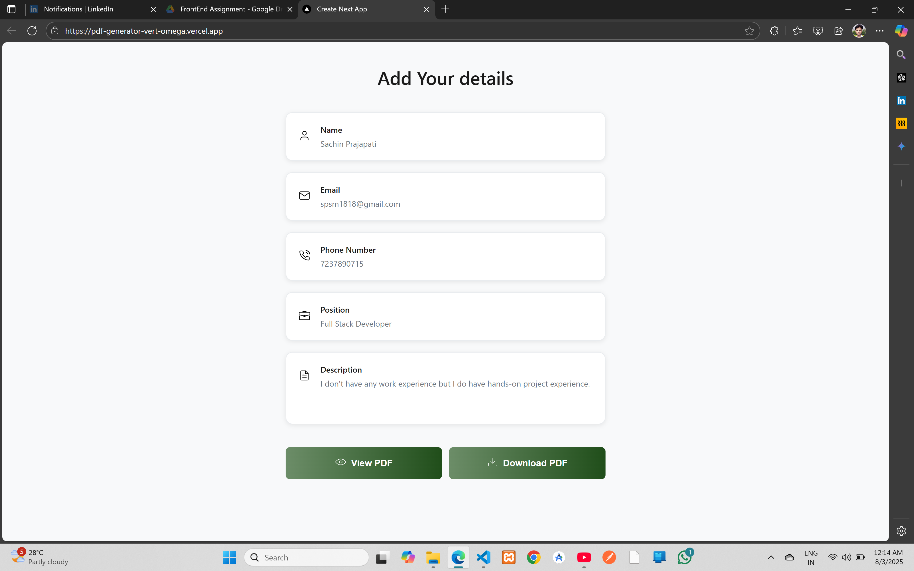
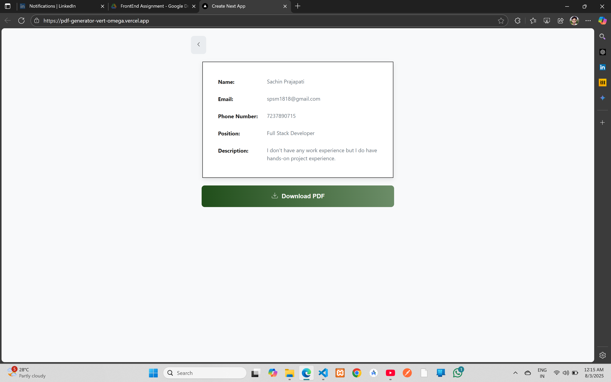
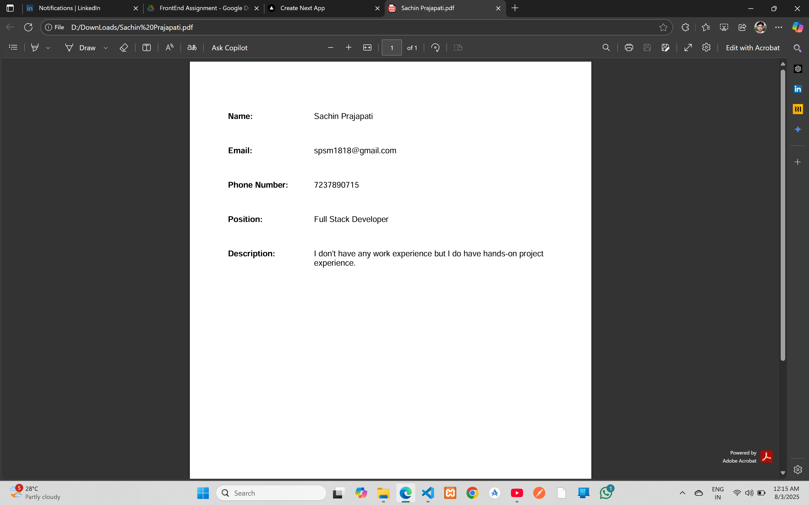

# 📄 ResumeMate - PDF Generator

#### Live Website: [https://pdf-generator-vert-omega.vercel.app/](https://pdf-generator-vert-omega.vercel.app/)

## Screenshots










## ✨ Features

- 📝 **Interactive Form**: Clean, user-friendly interface for entering resume details
- 👁️ **Live Preview**: See your resume before downloading
- 📱 **Responsive Design**: Works perfectly on all devices
- ✅ **Form Validation**: Real-time validation with helpful error messages
- 🎨 **Beautiful UI**: Modern design with gradient buttons and custom icons
- ⚡ **Instant PDF Generation**: Client-side PDF creation using jsPDF
- 💾 **One-Click Download**: Download your resume with a single click


## 🛠️ Tech Stack

- **Framework**: [Next.js 15.4.5](https://nextjs.org/) ⚛️
- **Language**: [TypeScript](https://www.typescriptlang.org/) 📘
- **Styling**: CSS Modules 🎨
- **PDF Generation**: [jsPDF 2.5.2](https://github.com/parallax/jsPDF) 📄
- **Icons**: Custom SVG Icons 🎯
- **Validation**: Custom form validation ✅

## 🚀 Getting Started

### Prerequisites

- Node.js 18+ 📦
- npm or yarn 🧶

### Installation

1. **Clone the repository**
   ```bash
   git clone https://github.com/skp3214/pdf-generator.git
   cd pdf-generator
   ```

2. **Install dependencies**
   ```bash
   npm install
   # or
   yarn install
   ```

3. **Run the development server**
   ```bash
   npm run dev
   # or
   yarn dev
   ```

4. **Open your browser**
   Navigate to [http://localhost:3000](http://localhost:3000) 🌐

## 📋 Usage

1. **Fill in your details** 📝
   - Name (required)
   - Email (required, valid format)
   - Phone Number (required, minimum 10 digits)
   - Position
   - Description

2. **Preview your resume** 👁️
   - Click "View PDF" to see a preview
   - Review your information before downloading

3. **Download your PDF** 💾
   - Click "Download PDF" to save your resume
   - File will be saved as `[YourName].pdf`

## 🎯 Form Validation

The application includes comprehensive validation:

- ✅ **Name**: Required field
- ✅ **Email**: Required + valid email format
- ✅ **Phone**: Required + minimum 10 digits
- 🔄 **Real-time validation**: Errors clear as you type
- 🚫 **Prevents submission**: Won't generate PDF until all required fields are valid

## 📁 Project Structure

```
pdf-generator/
├── 📂 app/
│   ├── 🎨 globals.css
│   ├── 🏠 layout.tsx
│   ├── 📄 page.tsx (Main component)
│   └── 🎨 page.module.css
├── 📂 components/
│   └── 🎯 Icon.tsx (Custom icon component)
├── 📂 public/
│   └── 📂 icons/ (SVG icon files)
├── 📂 types/
│   └── 📄 html2pdf.d.ts
├── ⚙️ next.config.ts
├── 📦 package.json
└── 📖 README.md
```

## 🎨 Design Features

- **Green Gradient Buttons**: Eye-catching call-to-action buttons
- **Horizontal Layout**: Information displays side-by-side for better readability
- **Custom Icons**: Professional SVG icons for each field
- **Error Styling**: Clear visual feedback for validation errors
- **Responsive Design**: Adapts to different screen sizes


